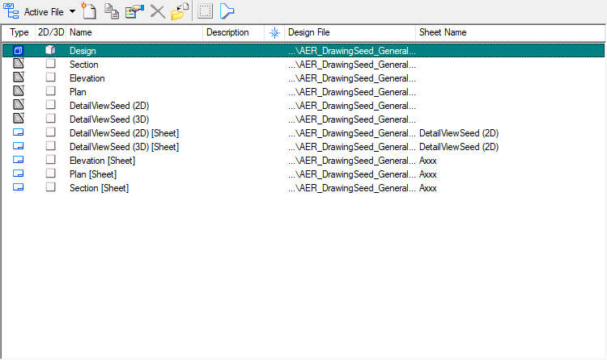
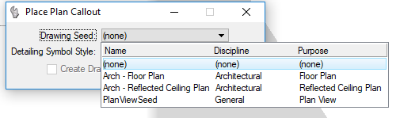
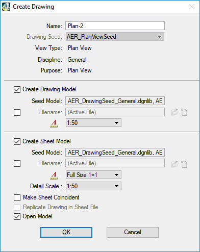

### Global Variables

#### AER_BUILD_WORKSPACE
Name of Aerison's client

#### AER_SITE
Name of Aerison's Standard working directory

### Seed Files
####AER_DrawingSeed.dgn
This file is used purely for the creation of the 2d drawing
AER_DesignSeed_Structural.dgnlib

This seed file is used to create drawings from Dynamic Views

AER_DrawingSeed_General.dgnlib
This is the file used when you create a drawing using the Plan, Section or Detail toolbar

The Plan [Sheet] also acts as the seed file if you select to create a sheet

###AER_SheetSeed_ISO.dgn

###Printing

###DGNLIB

###Cells
Need to copy of cell library files

###Customize
Copy over custom toolbars

###Datasets
Copy over datasets from laptop

###Datagroups

###MDLAPPS

###TitleBlock
Tagset for titleblock

#CSI Build
The CSI build is an Aerison project that uses the AER_Workspace

##Custom toolbars

